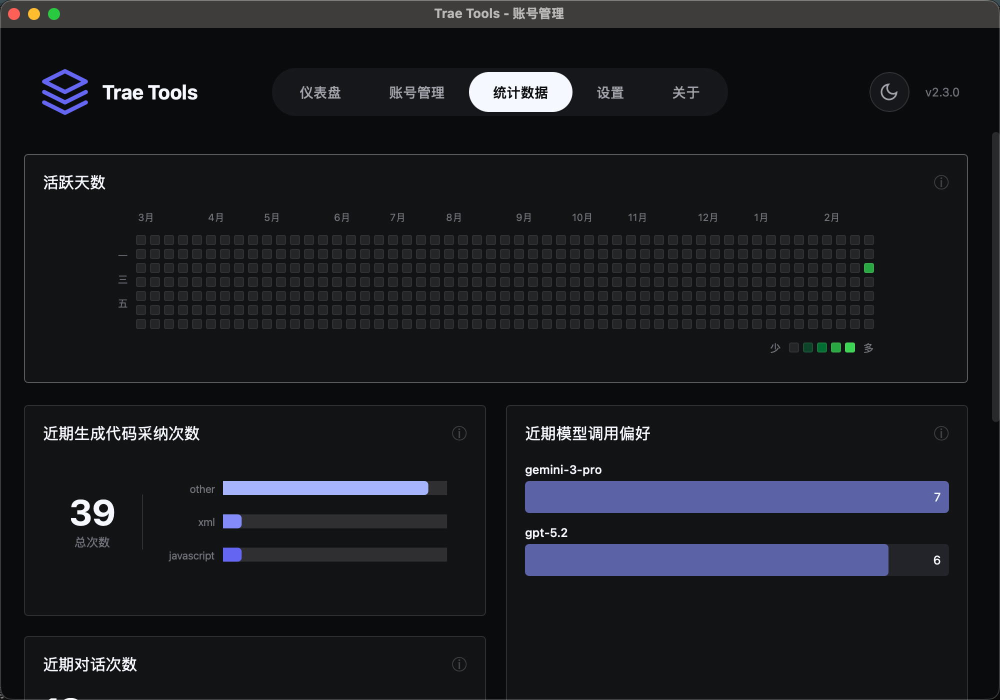
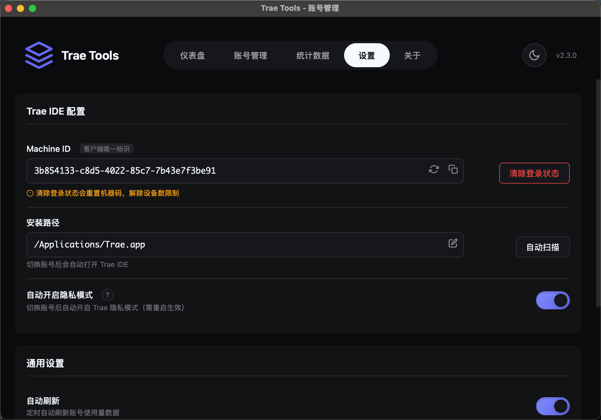

# 🚀 Trae Tools

**一款强大的 Trae IDE 多账号管理工具**

[功能特性](#-功能特性) • [快速开始](#-快速开始) • [使用指南](#-使用指南) • [常见问题](#-常见问题) • [贡献指南](#-贡献指南)

---

⭐ Star 星星走起 动动发财手点点 ⭐
如果这个项目对你有帮助，请不要吝啬你的 Star ⭐ 你的支持是我持续更新的最大动力！💪

👆 点击右上角 Star 按钮支持一下吧！会持续更新维护 👆
 
---

## 📖 项目简介

Trae Tools 是一款专为 Trae IDE 用户打造的多账号管理工具。通过本工具，你可以轻松管理多个 Trae 账号，一键切换账号，实时查看使用量，让你的 Trae IDE 使用体验更加便捷高效！

🎯 为什么选择 Trae Tools？
🔄 一键切换账号 - 自动关闭 Trae IDE，切换账号后自动重新打开
📊 实时使用量监控 - 随时查看每个账号的 Token 使用情况
🎨 现代化界面 - 简洁美观的用户界面，操作流畅
🔒 安全可靠 - 本地存储，数据安全有保障
⚡ 高效便捷 - 支持批量添加账号，快速管理多个账号
🛠️ 功能丰富 - 机器码管理、使用记录查询、账号详情查看、解除设备数限制

## ✨ 功能展示

## 📚 使用指南

### 教程里有安装包和使用说明

1. 教程地址：https://my.feishu.cn/wiki/HKNjwyB97iRE7ukD2Zxchdbfnhb

## 🎯 使用场景

### 场景一：多账号轮换使用

如果你有多个 Trae 账号，可以通过本工具快速切换，充分利用每个账号的额度。

### 场景二：快速登陆导入

多种方式直接登陆或者导入账号

### 场景三：账号使用量监控

实时监控每个账号的使用情况，合理分配使用额度，避免超额。

### 场景四：测试不同账号

开发者可以快速切换不同账号，测试不同权限下的功能表现。

---